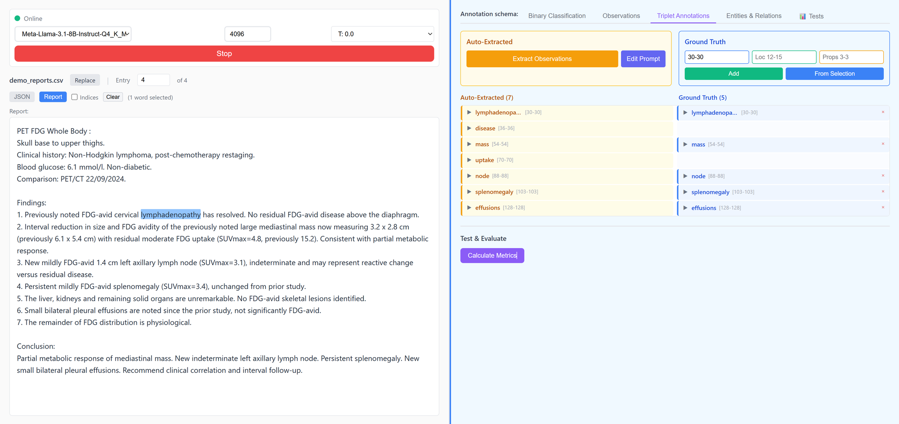

# RadCount

Local LLM-powered radiology report analysis. Runs a browser UI for extracting structured clinical data from free-text reports, evaluating extraction quality against ground truth, and iterating on prompts. All inference runs locally via llama.cpp.



## Requirements

- Windows 10 or 11
- NVIDIA GPU with 8 GB+ VRAM
- ~12 GB disk space for model and dependencies on first run

## Setup

Double-click `setup.bat`. It will install Python if needed, then handle everything else automatically. Alternatively, run `python startup.py` if Python is already installed.

On first run, the script will:
1. Create a virtual environment and install dependencies (including CUDA-accelerated PyTorch)
2. Download llama.cpp (GPU build when possible)
3. Download Meta-Llama-3.1-8B-Instruct (Q4_K_M quantisation, ~4.9 GB)
4. Apply database migrations
5. Start the Django server at `http://127.0.0.1:8000`

Subsequent runs skip straight to step 5. The LLM server starts automatically on port 8080 when Django loads. Interrupted model downloads resume on the next run.

## Features

The UI is a single page split into a left panel (report viewer, data controls) and a right panel (annotation tabs, extraction results).

### LLM Server Controls

Start and stop the llama.cpp server from the UI. Select which `.gguf` model to load (place additional models in `llm_models/`), set the context window size (512--32768 tokens), and adjust temperature.

### Data Import

Upload a CSV of radiology reports. One CSV at a time; uploading a new one replaces the old. Navigate entries by number. Toggle between JSON view (all fields) and report view (readable text with optional word indices for span selection).

### Context Files

Upload, create, edit, or delete `.txt` and `.json` files in the `Context/` directory. Files prefixed with `sys-` are treated as system prompts. All other files become user context. These are used for one-shot LLM queries via the generate button.

### Extraction Functions

Write Python filter functions that run against CSV data to produce smaller context files. Results are saved to `Context/` for use in LLM prompts. A debug console shows print output.

### Annotation Modes

Four tabs cover different levels of extraction granularity. Each follows the same workflow: create ground truth manually, run LLM auto-extraction, compare results, and calculate metrics (precision, recall, F1).

**Binary Classification** -- Assign yes/no labels to reports (e.g. "pneumonia present"). Define custom labels. Run LLM classification against the current report or batch process.

**Observations** -- Extract individual clinical findings as word-level spans. Select words in the report viewer to set ground truth, or let the LLM extract them. Metrics compare extracted spans against ground truth.

**Triplets** -- Extract structured (observation, anatomical location, properties) tuples. Two-pass extraction: first identify observations, then resolve locations and properties. Metrics evaluate hard and soft matching.

**Entities and Relations** -- Full knowledge-graph extraction. Two-stage pipeline: extract typed entities first (anatomy, observations with certainty, measurements), then extract typed relations between them (located_at, suggestive_of, modify, etc.). Supports multiple schemas:
- RadGraph (generic radiology)
- PET-CT Oncology (15 entity types, 14 relation types)
- Custom user-defined schemas

Switch the active schema from the UI. Create, edit, or delete schemas.

### Prompt Management

Each extraction mode has its own editable prompt templates. The UI tracks which prompt is active and lets you save, rename, or delete prompt variants. This is the primary mechanism for iterating on extraction quality.

### Evaluation and Testing

Run extraction on the current entry or across all entries with ground truth. Metrics are calculated per-entry and in aggregate (TP/FP/FN counts, precision, recall, F1). Each run can be logged as a test with its prompt, model, and results. Compare logged tests side-by-side or export all tests to CSV.

## Project Structure

```
startup.py          One-click setup and launch
setup.bat           Windows entry point (bootstraps Python)
manage.py           Django management
radcount/           Django project config
llm_interface/      Main app (views, templates, LLM service)
llm_models/         .gguf model files (gitignored)
llama_cpp/          llama.cpp binaries (gitignored)
Context/            LLM context files (gitignored)
large_data/         Uploaded CSV files (gitignored)
schemas.json        Entity/relation schema definitions
```
